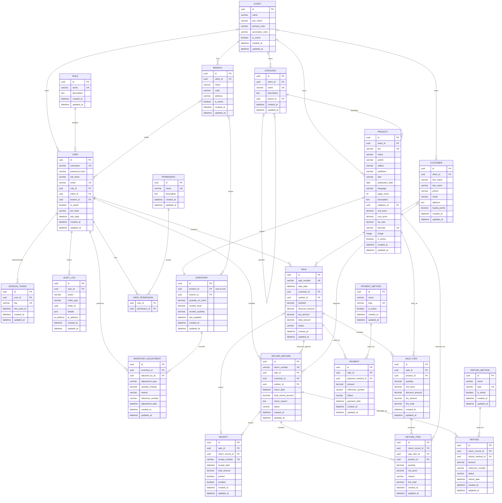

# Book Store POS ER Diagram

This ER diagram is generated from the Django models in `backend/apps/*/models.py`.
All concrete models inherit `UUIDModel`, so each table includes:

- `id` UUID primary key
- `created_at` timestamp
- `updated_at` timestamp

## Notes

- `USER_PERMISSION` represents Django's implicit many-to-many join table for `User.permissions`.
- `RETURN_RECORD` represents the Django model named `Return`; the diagram avoids using `RETURN` as an entity name because it can be confused with a keyword.
- `Receipt.sale` and `Receipt.return_record` are nullable one-to-one relationships, allowing receipts for either sales or returns.
- `Branch` has a unique constraint on `(client, code)`.
